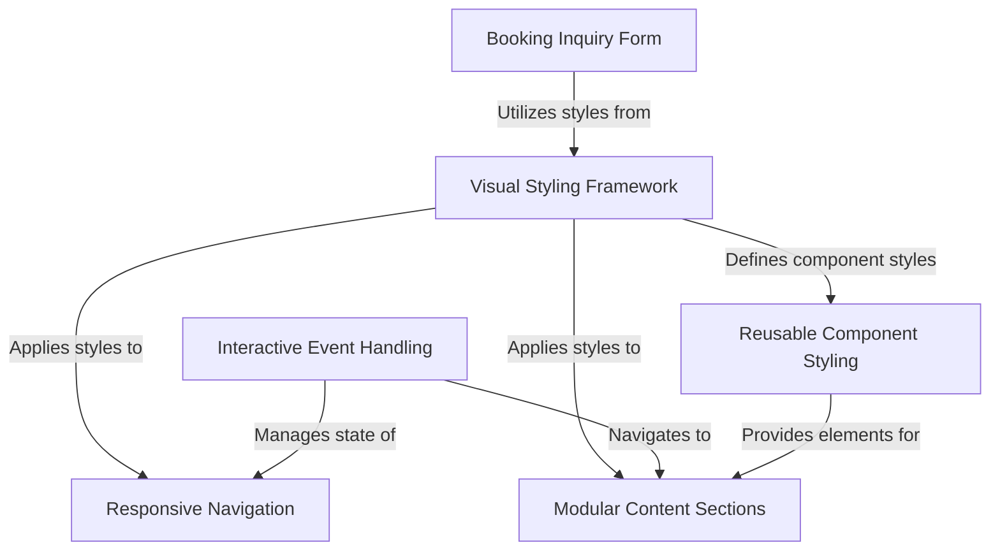
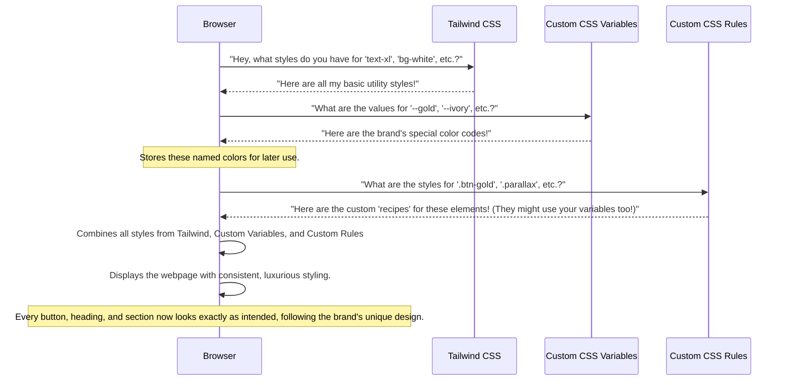
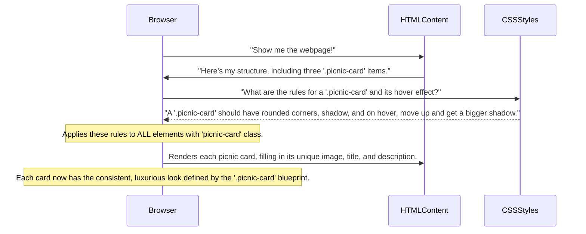
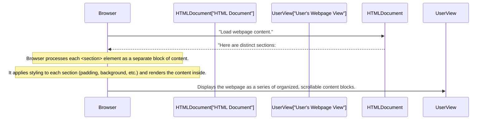
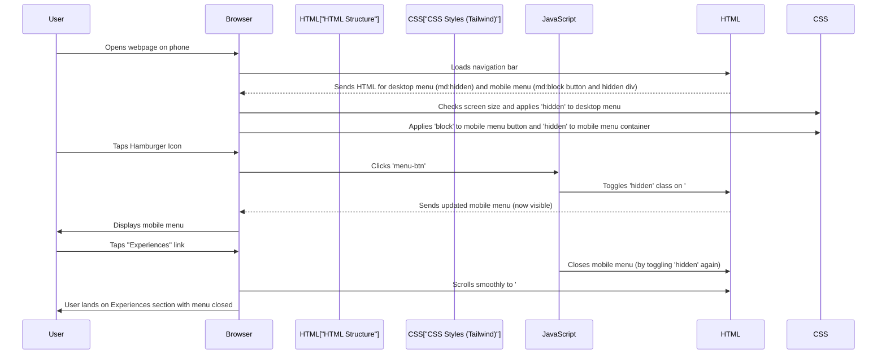
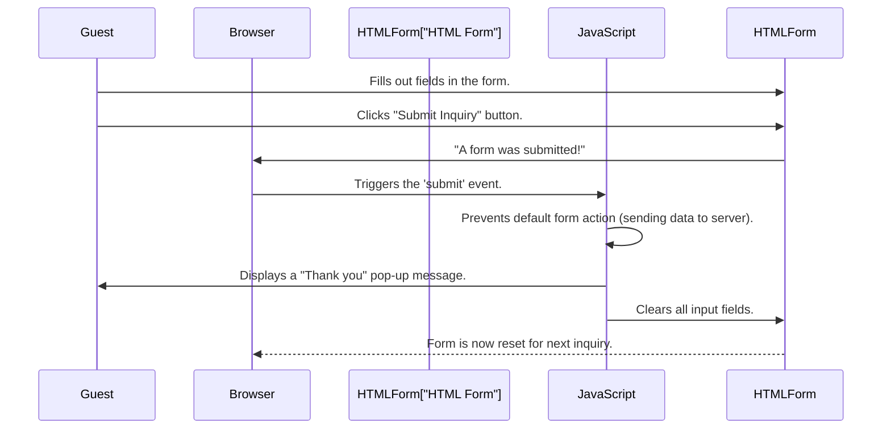
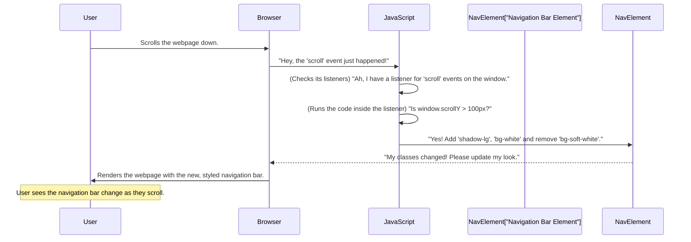

# Tutorial: Luxurious_Picnic_brand

The `Luxurious_Picnic_brand` project is a **modern website** for a company specializing in *luxury outdoor picnic experiences*. It allows users to effortlessly explore various **picnic packages**, view a captivating gallery of past setups, read testimonials, and easily **submit booking inquiries** through a dedicated form. The site is crafted to offer a *consistent, elegant aesthetic* and a **responsive, interactive user experience** across all devices.


## Visual Overview



## Chapters

1. [Visual Styling Framework
](01_visual_styling_framework_.md)
2. [Reusable Component Styling
](02_reusable_component_styling_.md)
3. [Modular Content Sections
](03_modular_content_sections_.md)
4. [Responsive Navigation
](04_responsive_navigation_.md)
5. [Booking Inquiry Form
](05_booking_inquiry_form_.md)
6. [Interactive Event Handling
](06_interactive_event_handling_.md)

---

<sub><sup>Generated by [AI Codebase Knowledge Builder](https://github.com/The-Pocket/Tutorial-Codebase-Knowledge).</sup></sub>

# Chapter 1: Visual Styling Framework

Welcome to the Éclat Picnics technical guide! In this first chapter, we're going to uncover the secrets behind our website's beautiful, consistent, and luxurious look. Think of it like a master artist's toolkit – it has all the right brushes, colors, and techniques to create stunning paintings every time.

### The Problem: Making Everything Look Coordinated

Imagine you're designing a website for "Luxurious Picnics." You want every button to have that signature gold color, every heading to use an elegant fancy font, and specific background images to have a unique, dreamy effect.

If you had to manually set the color, font, and other details for *every single element* on *every single page*, it would be a nightmare! It would take forever, you'd make mistakes, and if you decided to change the gold color slightly, you'd have to update hundreds of places. That's not very luxurious or efficient!

### The Solution: Our Visual Styling Framework

Our **Visual Styling Framework** solves this problem by providing a smart, organized way to apply designs across the entire website. It's like having a detailed "brand style guide" built directly into our code. It combines three main ingredients:

1.  **Tailwind CSS**: Your basic building blocks.
2.  **Custom CSS Variables**: Your brand's special colors and settings.
3.  **Custom CSS Rules**: Your unique design "recipes" for specific elements.

Let's break down each part!

---

### 1. Tailwind CSS: The Basic Building Blocks

Think of Tailwind CSS like a giant box of pre-labeled LEGO bricks. Each brick (or "class") has a specific job: make text bigger (`text-xl`), make the background blue (`bg-blue-500`), add space around something (`p-4`), or make corners round (`rounded`).

Instead of writing custom CSS for every single style, you just add these small, descriptive classes directly to your HTML elements.

**How it helps:** It gives us a super-fast way to handle common styling tasks like spacing, text sizes, and basic colors, without reinventing the wheel every time.

**Example:**
Let's say you want a simple button with some padding and rounded corners.

```html
<button class="bg-gray-200 py-2 px-4 rounded-lg">
    Standard Button
</button>
```

In this code:
*   `bg-gray-200` makes the background a light gray.
*   `py-2` adds vertical padding.
*   `px-4` adds horizontal padding.
*   `rounded-lg` makes the corners slightly rounded.

This approach keeps our HTML clean and makes it easy to see what styles are applied at a glance.

---

### 2. Custom CSS Variables: Your Brand's Special Colors

While Tailwind provides many colors, we have very specific "Éclat Picnics" colors, like our signature **gold** or **ivory**. Instead of remembering color codes like `#D4AF37` for gold, we can give them friendly names! This is where **Custom CSS Variables** come in.

Think of them like naming your favorite colors or fonts in a design program: "Our Signature Gold," "Soft White Background," "Primary Text Color."

**How it helps:** It ensures that our brand colors are *always* consistent. If we ever decide to change our signature gold from `#D4AF37` to something slightly different, we only change it in *one place*, and it updates everywhere on the site!

**Example:**
In our `code.html` file, inside the `<style>` section, you'll see a special block:

```css
/* Inside the <style> section of code.html */
:root {
    --gold: #D4AF37;       /* Our signature gold color */
    --ivory: #FFFFF0;      /* A soft, warm white */
    --taupe: #483C32;      /* A muted brownish-gray */
    --charcoal: #333333;   /* Our main dark text color */
}
```

*   `:root` is a special selector that means these variables are available everywhere on the page.
*   `--gold`, `--ivory`, etc., are our custom variable names, each storing a specific color code.

To use these variables, we use `var()`:

```css
.gold-accent {
    color: var(--gold); /* This text will be our signature gold */
}
```

And in our HTML:

```html
<div class="logo">Éclat <span class="gold-accent">Picnics</span></div>
```

This makes the word "Picnics" appear in our exact brand gold color!

---

### 3. Custom CSS Rules: Unique Design "Recipes"

Sometimes, you need to combine a few styles for a special element, or create unique effects that aren't easily done with just one Tailwind class. This is where **Custom CSS Rules** come in.

Think of these as your special "recipes" for unique design elements, like "Our Fancy Gold Button" or "Dreamy Background Effect." They let us define more complex behaviors, like what happens when you hover over a button, or a background image that stays fixed while you scroll (`parallax` effect).

**How it helps:** It allows us to build complex, unique, and interactive elements that define the luxurious feel of our brand, while still keeping our code organized.

**Example: The Gold Button**
Our "Book Now" buttons have a distinct gold color and a subtle animation when you hover over them. We create a custom CSS rule for this:

```css
/* Inside the <style> section of code.html */
.btn-gold {
    background-color: var(--gold); /* Uses our custom gold color */
    color: var(--ivory);           /* Text color is our custom ivory */
    transition: all 0.3s ease;     /* Makes changes smooth */
}

.btn-gold:hover {
    background-color: #C19A1A;     /* A slightly darker gold on hover */
    transform: translateY(-2px);   /* Button moves up slightly */
}
```

Now, any HTML element with the class `btn-gold` will automatically have this luxurious look and interactive hover effect:

```html
<button class="btn-gold px-6 py-2 rounded-full font-medium">Book Now</button>
```

Notice how we combine `btn-gold` (our custom recipe) with Tailwind classes like `px-6`, `py-2`, `rounded-full`, and `font-medium` for extra padding, rounded corners, and bold text. This is the power of combining them!

**Example: The Parallax Effect**
Another unique rule is for our `parallax` effect on some background images, which makes them appear to move slower than the foreground content, creating a sense of depth:

```css
/* Inside the <style> section of code.html */
.parallax {
    background-attachment: fixed; /* Keeps the background image fixed */
    background-position: center;  /* Centers the background image */
    background-repeat: no-repeat; /* Prevents image from repeating */
    background-size: cover;       /* Ensures image covers the area */
}
```

And then in our HTML:

```html
<section id="home" class="pt-24 h-screen flex items-center justify-center parallax" style="background-image: ...">
    <!-- ... content ... -->
</section>
```

This gives our hero section that immersive, high-end feel.

---

### How It All Works Together

Let's imagine you load the Éclat Picnics website in your web browser. Here's a simplified view of how our Visual Styling Framework makes it look beautiful:



This diagram shows how your web browser first loads Tailwind's general styles, then learns about our specific brand colors and custom design "recipes," and finally combines all of these to make your page look amazing and consistent.

---

### Code Deep Dive

All of these styling elements are located in our `Luxurious_Picnic_brand/code.html` file.

First, we bring in Tailwind CSS directly from the internet. This line is in the `<head>` section:

```html
<!-- In code.html, inside the <head> -->
<script src="https://cdn.tailwindcss.com"></script>
```

This single line tells the browser to download and apply all the thousands of ready-made styling classes that Tailwind provides.

Next, within the same `<head>` section, we have a `<style>` block. This is where we add all our custom sauce!

```html
<!-- In code.html, inside the <head> -->
<style>
    /* 1. We bring in our fancy fonts! */
    @import url('https://fonts.googleapis.com/css2?family=Cormorant+Garamond:wght@300;400;500;600;700&family=Montserrat:wght@100;200;300;400;500;600&display=swap');
    
    /* 2. Here are our custom CSS Variables (our brand colors) */
    :root {
        --gold: #D4AF37;
        --ivory: #FFFFF0;
        --taupe: #483C32;
        --charcoal: #333333;
    }
    
    /* 3. Global font settings for the whole page */
    body {
        font-family: 'Montserrat', sans-serif; /* Main body text font */
        color: var(--charcoal);               /* Main text color */
        scroll-behavior: smooth;              /* Smooth scrolling when clicking links */
    }
    
    /* 4. Special fonts for headings and our logo */
    h1, h2, h3, h4, .logo {
        font-family: 'Cormorant Garamond', serif; /* Elegant heading font */
        font-weight: 500;
    }
    
    /* 5. Our specific custom rules, like the gold accent and buttons */
    .gold-accent {
        color: var(--gold); /* Uses the --gold variable */
    }
    
    .btn-gold {
        background-color: var(--gold); /* Uses the --gold variable */
        color: var(--ivory);           /* Uses the --ivory variable */
        transition: all 0.3s ease;     /* Makes hover smooth */
    }
    
    .btn-gold:hover {
        background-color: #C19A1A;     /* Darker gold on hover */
        transform: translateY(-2px);   /* Slight lift on hover */
    }
    
    /* 6. A soft white background rule */
    .bg-soft-white {
        background-color: rgba(255, 255, 255, 0.9); /* A slightly transparent white */
    }
    
    /* 7. The magical parallax effect rule */
    .parallax {
        background-attachment: fixed;
        background-position: center;
        background-repeat: no-repeat;
        background-size: cover;
    }
    
    /* 8. Fun hover effect for picnic cards */
    .picnic-card:hover {
        transform: translateY(-10px);
        box-shadow: 0 20px 30px rgba(0, 0, 0, 0.1);
    }
    
    /* 9. Highlight for form inputs when you click them */
    .input-highlight:focus {
        border-color: var(--gold);
        box-shadow: 0 0 0 1px var(--gold);
    }
</style>
```

This block is crucial! It tells the browser:
1.  Which elegant fonts to use (Cormorant Garamond and Montserrat).
2.  What our brand's exact colors are, stored as easy-to-use variables.
3.  How specific elements should look and behave (like our gold buttons, the `.gold-accent` text, and the `.parallax` backgrounds).

By combining these three powerful concepts, we can ensure that Éclat Picnics always looks high-end, elegant, and perfectly consistent across every page.

---

### Conclusion

In this chapter, you've learned that our **Visual Styling Framework** is like a well-organized design toolkit. It uses:

*   **Tailwind CSS** for quick, utility-based styling.
*   **Custom CSS Variables** to define and easily reuse our specific brand colors.
*   **Custom CSS Rules** to create unique design elements and interactive effects.

This powerful combination ensures our website always has a consistent and luxurious look and feel, making it easy to apply and modify visual elements throughout the site.

Next, we'll dive into how we use these styling concepts to build parts of our website that can be used again and again, saving us time and ensuring consistency. Get ready to explore [Reusable Component Styling](02_reusable_component_styling_.md)!

---

<sub><sup>Generated by [AI Codebase Knowledge Builder](https://github.com/The-Pocket/Tutorial-Codebase-Knowledge).</sup></sub> <sub><sup>**References**: [[1]](https://github.com/Priyabrata18/Luxurious_Picnic_brand/blob/9551a725366024fea8607c22e991ec391e7601e1/Luxurious_Picnic_brand/code.html)</sup></sub>

# Chapter 2: Reusable Component Styling

Welcome back to the Éclat Picnics technical guide! In [Chapter 1: Visual Styling Framework](01_visual_styling_framework_.md), we learned about our design toolkit: Tailwind CSS for basic building blocks, custom CSS variables for our brand colors, and custom CSS rules for unique design "recipes." We now have all the ingredients and a beautiful palette to work with.

But what if we need to display many similar items, like our different luxury picnic packages? How can we make sure each one looks perfectly styled and consistent, without repeating ourselves endlessly? This is where **Reusable Component Styling** comes in!

### The Problem: Making Similar Things Look Consistently Luxurious

Imagine you're showcasing our "Romantic Rendezvous," "Garden Gathering," and "Serene Escape" picnic packages. Each package needs to display:

*   A beautiful image.
*   A clear title (e.g., "Romantic Rendezvous").
*   A brief description.
*   A list of included features.
*   Its starting price.
*   A "Book Now" button.

If we were to design and style each of these packages from scratch, it would be like designing a completely new art frame for every single artwork in a gallery. It would be:

1.  **Time-consuming:** You'd write very similar code over and over.
2.  **Inconsistent:** Small differences would creep in, making the website look less polished.
3.  **Hard to update:** If you wanted to change the border style or button size for *all* packages, you'd have to edit every single one manually! That's not very efficient or luxurious.

### The Solution: Reusable Component Styling

Our **Reusable Component Styling** approach solves this by creating a single, beautiful "blueprint" for how these similar items should look. We call this blueprint a "component." For our picnic packages, we use a "card" component.

Think of it like this: Instead of designing individual frames for each artwork, we design *one perfect, elegant display frame* that can hold any artwork. Each frame (or "card") will have the same stylish border, shadow, and layout, but the artwork inside (the picnic package details) will be unique to each one.

This ensures:

*   **Consistency:** Every picnic package looks like it belongs to the Éclat Picnics brand.
*   **Efficiency:** We write the styling code once and use it many times.
*   **Easy Updates:** Change the "blueprint" (the card's style) in one place, and *all* cards on the website update automatically!

### How to Use Our Reusable Components: The Picnic Card

Let's look at how we build our picnic package cards using this idea.

**1. The Card's Blueprint (HTML Structure):**

Each picnic package uses the exact same HTML structure, wrapped in a main `div` with the special class `picnic-card`.

Here's a simplified version of the blueprint for one card:

```html
<div class="picnic-card bg-white rounded-xl shadow-lg transition-all duration-300 hover:shadow-xl">
    <div class="h-64 overflow-hidden">
        
    </div>
    <div class="p-6">
        <h3 class="text-xl font-semibold mb-2">Package Title Goes Here</h3>
        <p class="text-gray-600 mb-4">Short description of the package...</p>
        <!-- A list of features would go here -->
        <div class="flex justify-between items-center">
            <p class="text-xl font-semibold">Price</p>
            <button class="btn-gold px-4 py-2 rounded-full text-sm font-medium">Book Now</button>
        </div>
    </div>
</div>
```

**What's happening here?**

*   The outer `div` has `picnic-card` and other Tailwind classes (`bg-white`, `rounded-xl`, `shadow-lg`) that give it its overall look: a white background, rounded corners, and a shadow.
*   Inside, there's a `div` for the image, ensuring it fills its space and has a subtle zoom effect on hover (thanks to `hover:scale-105`).
*   Another `div` holds the text content, with padding (`p-6`).
*   The `h3` (title), `p` (description), and `button` (our [Visual Styling Framework](01_visual_styling_framework_.md)'s `btn-gold`) are all standard elements styled with Tailwind classes to look elegant.

**2. Populating the Blueprint with Content:**

Now, to create our three picnic packages, we simply use this `picnic-card` blueprint three times, changing only the *specific content* for each package: the image `src`, the `alt` text, the `h3` title, the `p` description, the list items, and the price.

Here's how two packages look side-by-side in our `code.html` file, demonstrating the reuse:

```html
<!-- In code.html, inside the #services section -->

<!-- Package 1: Romantic Rendezvous -->
<div class="picnic-card bg-white rounded-xl overflow-hidden shadow-lg transition-all duration-300 hover:shadow-xl">
    <div class="h-64 overflow-hidden">
        
    </div>
    <div class="p-6">
        <h3 class="text-xl font-semibold">Romantic Rendezvous</h3>
        <p class="text-gray-600 mb-4">Perfect for anniversaries, proposals...</p>
        <!-- ... features list ... -->
        <div class="flex justify-between items-center">
            <p class="text-xl font-semibold">From $350</p>
            <button class="btn-gold px-4 py-2 rounded-full text-sm font-medium">Book Now</button>
        </div>
    </div>
</div>

<!-- Package 2: Garden Gathering -->
<div class="picnic-card bg-white rounded-xl overflow-hidden shadow-lg transition-all duration-300 hover:shadow-xl">
    <div class="h-64 overflow-hidden">
        
    </div>
    <div class="p-6">
        <h3 class="text-xl font-semibold mb-2">Garden Gathering</h3>
        <p class="text-gray-600 mb-4">Ideal for birthday celebrations...</p>
        <!-- ... features list ... -->
        <div class="flex justify-between items-center">
            <p class="text-xl font-semibold">From $600</p>
            <button class="btn-gold px-4 py-2 rounded-full text-sm font-medium">Book Now</button>
        </div>
    </div>
</div>
```
Notice how similar the `div` structures are, with just the image source, `alt` text, title, description, and price changing. This is the power of reusable components!

### How It Works Behind the Scenes

When your web browser loads the `code.html` file, it reads through the HTML code.



Each time the browser sees a `div` with the `picnic-card` class, it applies all the styling rules associated with that class, ensuring they all look the same. Then it fills in the unique text and images for that particular card.

### Code Deep Dive: The `.picnic-card` Style

In our `Luxurious_Picnic_brand/code.html` file, inside the `<style>` section, you'll find a specific CSS rule for `picnic-card:hover`. This rule is a great example of our custom CSS rules from [Chapter 1: Visual Styling Framework](01_visual_styling_framework_.md).

```css
/* In code.html, inside the <style> section */
.picnic-card:hover {
    transform: translateY(-10px); /* Moves the card up by 10 pixels */
    box-shadow: 0 20px 30px rgba(0, 0, 0, 0.1); /* Adds a bigger, softer shadow */
}
```

This single, short CSS rule is incredibly powerful! Because every picnic package uses the `picnic-card` class, *all three* of our package cards (and any new ones we add!) will automatically get this elegant hover effect: they will subtly lift up and cast a larger shadow when someone hovers their mouse over them.

This is the core idea of reusable components: define the common look and behavior once, then apply it wherever needed, only changing the unique content.

### Benefits of Reusable Components

Let's compare building our website with and without reusable components:

| Feature             | Without Reusable Components                 | With Reusable Components                    |
| :------------------ | :------------------------------------------ | :------------------------------------------ |
| **Consistency**     | Hard to maintain, styles can drift apart.   | Guarantees uniform look across the site.    |
| **Maintenance**     | Changes require editing many separate places.| Update one component, affects all instances.|
| **Development Speed** | Slow, repetitive coding for similar items.  | Fast, just plug in new content to blueprint.|
| **Code Readability**| Can be messy with duplicated styles.        | Cleaner, easier to understand purpose.      |

As you can see, reusable component styling is a cornerstone of building a maintainable, scalable, and visually consistent website like Éclat Picnics.

### Conclusion

In this chapter, you've learned that **Reusable Component Styling** allows us to build common elements, like our elegant picnic package cards, once and use them many times. By defining a "blueprint" (like the `.picnic-card` class and its structure), we ensure consistency, save time, and make our website much easier to manage and update. It's like having a set of beautifully crafted, identical display frames for all your exquisite artworks!

Next, we'll expand on this idea by looking at how we build larger, distinct sections of our website that can also be arranged and rearranged easily. Get ready to explore [Modular Content Sections](03_modular_content_sections_.md)!

---

<sub><sup>Generated by [AI Codebase Knowledge Builder](https://github.com/The-Pocket/Tutorial-Codebase-Knowledge).</sup></sub> <sub><sup>**References**: [[1]](https://github.com/Priyabrata18/Luxurious_Picnic_brand/blob/9551a725366024fea8607c22e991ec391e7601e1/Luxurious_Picnic_brand/code.html)</sup></sub>

# Chapter 3: Modular Content Sections

Welcome back to the Éclat Picnics technical guide! In [Chapter 2: Reusable Component Styling](02_reusable_component_styling_.md), we learned how to build small, repeating elements like our beautiful picnic package cards using a single "blueprint." Now, let's think even bigger: how do we organize an entire website, like our Éclat Picnics site, so it's easy to build, easy to navigate, and easy to update?

### The Problem: Organizing a Whole Website

Imagine our Éclat Picnics website is just one giant page of content. You'd have the main "Hero" image, then the "About Us" story, then the "Picnic Packages," then the "Gallery," then "Testimonials," and finally the "Contact Form" – all mashed together.

If everything was just one big, continuous block of code, it would be a nightmare!

1.  **Hard to Read:** Finding a specific piece of information would be like trying to find a needle in a haystack.
2.  **Hard to Navigate:** How would visitors jump directly to the "Picnic Packages" section without scrolling endlessly?
3.  **Hard to Maintain:** If you wanted to completely redesign the "About Us" section, you'd be digging through a massive file, risking accidentally changing something else. That's not very luxurious or efficient!

### The Solution: Modular Content Sections

Our **Modular Content Sections** approach solves this problem by dividing the entire webpage into distinct, self-contained blocks. Each block is like a separate "room" or "module" dedicated to a specific topic.

Think of it like constructing a building using pre-fabricated modules:
*   One module is the "Lobby" (our Hero Section).
*   Another is the "Office" (our About Section).
*   Another is the "Showroom" (our Services Section, where packages are displayed).
*   And so on.

Each module is a complete block with its own heading, text, and images. They are designed to fit together perfectly, creating a cohesive and organized whole.

This approach makes our website:

*   **Organized:** Each topic has its own clear space.
*   **Easy to Understand:** Visitors can quickly grasp what each part of the page is about.
*   **Easy to Navigate:** We can add links that jump directly to these specific sections.
*   **Maintainable:** You can work on one section without worrying about accidentally messing up another.

### How We Use Modular Content Sections

On the Éclat Picnics website, we define each major part of the page as a distinct `<section>`. We give each section a unique `id` (short for "identifier").

Let's look at how we define some of these sections in our `code.html` file:

**1. The Hero Section (id="home")**

This is the first thing visitors see, introducing our brand.

```html
<!-- In code.html -->
<section id="home" class="pt-24 h-screen flex items-center justify-center parallax" style="background-image: ...">
    <div class="text-center px-4 sm:px-6 lg:px-8">
        <h1 class="text-4xl md:text-6xl lg:text-7xl font-semibold text-white mb-4">Luxury Picnics, <span class="gold-accent">Perfected</span></h1>
        <!-- ... other content like description and buttons ... -->
    </div>
</section>
```
**Explanation:**
*   `id="home"`: This unique label lets us link directly to this section (like when you click "Home" in the navigation).
*   `class="..."`: These are [Tailwind CSS](01_visual_styling_framework_.md) classes that add padding (`pt-24`), make it full screen height (`h-screen`), center content (`flex items-center justify-center`), and apply our special `parallax` effect from [Chapter 1: Visual Styling Framework](01_visual_styling_framework_.md).
*   Inside this `<section>`, we put all the content related to our main hero message.

**2. The About Section (id="about")**

This section tells our brand's story.

```html
<!-- In code.html -->
<section id="about" class="py-20 px-4 sm:px-6 lg:px-8 max-w-7xl mx-auto">
    <div class="flex flex-col md:flex-row items-center gap-12">
        <div class="md:w-1/2">
            
        </div>
        <div class="md:w-1/2">
            <h2 class="text-3xl md:text-4xl font-semibold mb-6">Our <span class="gold-accent">Story</span></h2>
            <p class="text-gray-600 mb-6">Founded in 2020, Éclat Picnics began...</p>
            <!-- ... more text and feature boxes ... -->
        </div>
    </div>
</section>
```
**Explanation:**
*   `id="about"`: Another unique label for linking.
*   `class="py-20 ..."`: Adds vertical padding and centers the content on the page.
*   Inside, we have an image and text, which are specific to the "About Us" topic.

**3. The Services Section (id="services")**

Here, we showcase our different picnic packages.

```html
<!-- In code.html -->
<section id="services" class="py-20 bg-gray-50">
    <div class="max-w-7xl mx-auto px-4 sm:px-6 lg:px-8">
        <div class="text-center mb-16">
            <h2 class="text-3xl md:text-4xl font-semibold mt-2">Our <span class="gold-accent">Signature</span> Picnics</h2>
            <!-- ... section description ... -->
        </div>
        
        <div class="grid grid-cols-1 md:grid-cols-2 lg:grid-cols-3 gap-8">
            <!-- This is where our reusable picnic cards from Chapter 2 go! -->
            <div class="picnic-card bg-white ..."> ... </div>
            <div class="picnic-card bg-white ..."> ... </div>
            <div class="picnic-card bg-white ..."> ... </div>
        </div>
    </div>
</section>
```
**Explanation:**
*   `id="services"`: Used for direct linking from the navigation (e.g., "Experiences").
*   `class="py-20 bg-gray-50"`: Adds padding and a light gray background to visually separate this section.
*   Crucially, *inside* this section, you'll find our [Reusable Component Styling](02_reusable_component_styling_.md) in action, with multiple `picnic-card` elements displayed in a grid. This shows how modular sections are like large containers that hold smaller, reusable components.

### How It Works Behind the Scenes

When your web browser loads the Éclat Picnics `code.html` file, it processes these modular sections in a straightforward way:



The browser understands that each `<section>` tag defines a new, distinct content area. It applies the styling (like padding and background colors) that we've set for each section. Then, it places the content (text, images, and smaller components like `picnic-card`s) into these defined areas, creating a beautifully structured webpage.

### Benefits of Modular Sections

Let's compare building our website with one giant block of code versus using modular sections:

| Feature           | Without Modular Sections                  | With Modular Sections                       |
| :---------------- | :---------------------------------------- | :------------------------------------------ |
| **Organization**  | Content is jumbled, hard to find specific info. | Content is clearly separated by topic.      |
| **Navigation**    | Users must scroll manually to find things. | Easy to jump directly to specific topics using links. |
| **Maintenance**   | High risk of breaking other parts when updating one. | Changes to one section don't easily affect others. |
| **Development**   | Hard to work on specific parts.           | Easier for teams to work on different sections simultaneously. |

As you can see, embracing modular content sections is essential for creating a website that is not only visually appealing but also highly functional, easy to navigate, and straightforward to manage for our Luxurious Picnic brand.

### Conclusion

In this chapter, you've learned that **Modular Content Sections** are like building blocks for an entire webpage. By dividing our `code.html` into distinct `<section>` tags, each with a unique `id` and specific content, we create an organized, easy-to-understand, and maintainable website. This structure also forms the backbone for seamless navigation.

Next, we'll dive into how visitors can effortlessly move between these perfectly organized sections, even on different devices. Get ready to explore [Responsive Navigation](04_responsive_navigation_.md)!

---

<sub><sup>Generated by [AI Codebase Knowledge Builder](https://github.com/The-Pocket/Tutorial-Codebase-Knowledge).</sup></sub> <sub><sup>**References**: [[1]](https://github.com/Priyabrata18/Luxurious_Picnic_brand/blob/9551a725366024fea8607c22e991ec391e7601e1/Luxurious_Picnic_brand/code.html)</sup></sub>

# Chapter 4: Responsive Navigation

Welcome back to the Éclat Picnics technical guide! In [Chapter 3: Modular Content Sections](03_modular_content_sections_.md), we learned how to organize our website into distinct, easy-to-understand blocks like "Home," "About," and "Services." Now, how do we help our visitors easily jump between these sections, no matter what device they are using? This is where **Responsive Navigation** comes in!

### The Problem: Navigating on Different Devices

Imagine you're visiting the Éclat Picnics website to book a romantic picnic.

*   **On a big computer screen:** There's plenty of space at the top of the page. You can easily see all the menu options like "Home," "About," "Experiences," "Gallery," and "Contact" laid out clearly. You just click the one you want, and boom, you're there! This is great.

*   **On a small phone screen:** If we tried to squeeze all those menu options into a tiny phone screen, they would overlap, look messy, and be impossible to click. It would be a frustrating experience, definitely not luxurious!

How can we make sure our visitors can always find their way around, whether they're on a large desktop monitor or a small smartphone?

### The Solution: Responsive Navigation

Our **Responsive Navigation** system solves this problem by being "smart" about how it shows the menu. It's like having a smart directory that changes its display based on the size of the device you're using.

This system has two main "looks":

1.  **The Full Navigation Bar (for Desktops):** When you have a lot of screen space, the menu shows all the links clearly laid out, like a detailed map you'd use for a big road trip.
2.  **The "Hamburger" Menu (for Mobiles):** When space is tight (on a phone or tablet), the menu hides itself. Instead, you see a small, three-line icon (which looks a bit like a hamburger!). Tapping this "hamburger" makes the menu slide out, like pulling out a folded pocket map when you need it.

This ensures that Éclat Picnics is always easy to navigate, providing a seamless and elegant experience for everyone.

### How Our Navigation Works for You

From a user's perspective, this is very intuitive:

*   **On a Computer:** You'll see the full set of navigation links at the top of the page, visible at all times. Clicking "Experiences" will smoothly scroll you down to our [Services Section](03_modular_content_sections_.md) (where our picnic packages are).
    
    ```html
    <!-- Part of the navigation visible on desktops (and larger tablets) -->
    <div class="hidden md:block">
        <div class="ml-10 flex items-center space-x-8">
            <a href="#home" class="...">Home</a>
            <a href="#about" class="...">About</a>
            <a href="#services" class="...">Experiences</a>
            <!-- ... other links ... -->
            <button class="btn-gold ...">Book Now</button>
        </div>
    </div>
    ```
    This code snippet shows the part of our navigation that is `hidden` on small screens but `md:block` (meaning "block" visible) on medium-sized screens and up. `md` is a "breakpoint" from [Tailwind CSS](01_visual_styling_framework_.md) that means "medium screen size."

*   **On a Phone or Small Tablet:** You won't see the full menu right away. Instead, you'll see our luxurious logo on the left and a small "hamburger" icon on the right.
    
    ```html
    <!-- Hamburger button visible only on small screens -->
    <div class="md:hidden">
        <button id="menu-btn" class="text-gray-700">
            <i class="fas fa-bars text-xl"></i> <!-- This is the hamburger icon! -->
        </button>
    </div>
    ```
    Here, `md:hidden` means this button is *hidden* on medium screens and larger, but visible on smaller screens.

    Tapping the "hamburger" icon will reveal a full-height menu that slides down, letting you easily scroll and select any section. Tapping it again (or clicking a link) will hide the menu.

### How It Works Behind the Scenes: The Magic of Adaptability

Our Responsive Navigation cleverly uses a combination of HTML, CSS (specifically [Tailwind CSS](01_visual_styling_framework_.md)'s responsive classes), and a tiny bit of JavaScript to achieve this adaptable behavior.

Here's a simplified look at the steps when you interact with our navigation on a mobile device:



This diagram shows that the browser works with HTML to understand the structure, CSS to decide *what* to show based on screen size, and JavaScript to handle the interactive "open/close" action of the mobile menu.

### Code Deep Dive: Making It Adapt

Let's look at the key parts in `Luxurious_Picnic_brand/code.html` that make this happen.

**1. The Navigation Bar Structure**

Our main navigation (`<nav>`) element is `fixed` to the top of the page and uses `bg-soft-white` (from our [Visual Styling Framework](01_visual_styling_framework_.md)) for a luxurious, slightly transparent background.

```html
<!-- In code.html, at the top of the <body> -->
<nav class="fixed w-full bg-soft-white shadow-sm z-50 transition-all duration-500">
    <div class="max-w-7xl mx-auto px-4 sm:px-6 lg:px-8">
        <div class="flex justify-between h-24 items-center">
            <!-- Logo is always visible -->
            <div class="logo ...">Éclat <span class="gold-accent">Picnics</span></div>
            
            <!-- Desktop menu - HIDDEN on small screens, BLOCK on medium screens and up -->
            <div class="hidden md:block">
                <div class="ml-10 flex items-center space-x-8">
                    <a href="#home" class="... text-sm font-medium">Home</a>
                    <a href="#services" class="... text-sm font-medium">Experiences</a>
                    <!-- ... other desktop links ... -->
                </div>
            </div>
            
            <!-- Mobile menu button (Hamburger) - VISIBLE on small screens, HIDDEN on medium screens and up -->
            <div class="md:hidden">
                <button id="menu-btn" class="text-gray-700">
                    <i class="fas fa-bars text-xl"></i>
                </button>
            </div>
        </div>
    </div>
    <!-- The actual Mobile menu content - HIDDEN by default -->
    <div id="mobile-menu" class="hidden md:hidden bg-white w-full pb-4 px-4">
        <div class="pt-2 pb-3 space-y-1">
            <a href="#home" class="block px-3 py-2 ...">Home</a>
            <a href="#services" class="block px-3 py-2 ...">Experiences</a>
            <!-- ... other mobile links ... -->
        </div>
    </div>
</nav>
```
Notice how `hidden md:block` and `md:hidden` are used to tell Tailwind CSS when to show or hide parts of the navigation based on screen size. This is the core of making it responsive without writing complex CSS rules!

**2. The JavaScript Toggle**

The interactivity of the mobile menu comes from a small piece of JavaScript code:

```javascript
// In code.html, inside the <script> section at the very end of <body>
document.getElementById('menu-btn').addEventListener('click', function() {
    const menu = document.getElementById('mobile-menu');
    menu.classList.toggle('hidden'); // This is the key line!
});
```
This script finds our "hamburger" button (`menu-btn`) and waits for a `click`. When clicked, it finds the entire mobile menu container (`mobile-menu`) and `toggle`s the `hidden` class. If `hidden` is there, it removes it (making the menu appear). If `hidden` is not there, it adds it (making the menu disappear). Simple yet powerful!

**3. Smooth Scrolling and Auto-Close**

When you click on a navigation link, we want a smooth transition to the section, not an instant jump. This is achieved by:
*   The `scroll-behavior: smooth;` in our `body` CSS rules (from [Chapter 1: Visual Styling Framework](01_visual_styling_framework_.md)).
*   A little JavaScript that also handles closing the mobile menu:

```javascript
// In code.html, inside the <script> section
document.querySelectorAll('a[href^="#"]').forEach(anchor => {
    anchor.addEventListener('click', function (e) {
        e.preventDefault(); // Stop the default instant jump
        
        // Find the target section and scroll smoothly to it
        document.querySelector(this.getAttribute('href')).scrollIntoView({
            behavior: 'smooth'
        });
        
        // If the mobile menu is open, close it!
        const mobileMenu = document.getElementById('mobile-menu');
        if (!mobileMenu.classList.contains('hidden')) {
            mobileMenu.classList.add('hidden');
        }
    });
});
```
This script ensures that any link starting with `#` (meaning it's an internal link to a section) will scroll smoothly. Crucially, it also checks if the `mobile-menu` is currently visible (doesn't have the `hidden` class). If it is, it adds `hidden` back, making the menu disappear after you select a section. This keeps the user experience clean and focused.

### Comparing Navigation Types

| Feature           | Desktop Navigation (Full Bar)             | Mobile Navigation (Hamburger Menu)        |
| :---------------- | :---------------------------------------- | :---------------------------------------- |
| **Visibility**    | Always visible on larger screens.         | Hidden by default, revealed on tap.       |
| **Space Usage**   | Uses horizontal space efficiently.        | Optimizes for vertical space on small screens. |
| **Interaction**   | Direct click on visible links.            | Tap icon to open, then tap link to navigate. |
| **Consistency**   | Links always in same place.               | Consistent icon location, adaptive menu content. |

This adaptable approach is key to providing a user-friendly experience across the vast array of devices people use today.

### Conclusion

In this chapter, you've learned that **Responsive Navigation** is crucial for making the Éclat Picnics website easy to use on any device. By combining [Tailwind CSS](01_visual_styling_framework_.md)'s powerful responsive classes with simple JavaScript, we create:

*   A full, always-visible navigation bar for larger screens.
*   A hidden "hamburger" menu that appears on demand for smaller screens, gracefully closing after a selection.

This ensures that whether your guests are browsing on a computer or a smartphone, they can always effortlessly find and explore our luxurious picnic experiences.

Next, we'll dive into how we capture our guests' interest and gather all the necessary details for their dream picnic by exploring our interactive booking system. Get ready to explore [Booking Inquiry Form](05_booking_inquiry_form_.md)!

---

<sub><sup>Generated by [AI Codebase Knowledge Builder](https://github.com/The-Pocket/Tutorial-Codebase-Knowledge).</sup></sub> <sub><sup>**References**: [[1]](https://github.com/Priyabrata18/Luxurious_Picnic_brand/blob/9551a725366024fea8607c22e991ec391e7601e1/Luxurious_Picnic_brand/code.html)</sup></sub>
© 2025 Codebase to Tutorial. All rights reserved.

# Chapter 5: Booking Inquiry Form

Welcome back to the Éclat Picnics technical guide! In [Chapter 4: Responsive Navigation](04_responsive_navigation_.md), we perfected how our visitors can easily move around our beautiful website, no matter their device. Now that they've explored our luxurious packages and stunning galleries, they're surely eager to book their very own Éclat Picnic! But how do we get all the important details from them in a smooth and elegant way?

### The Problem: Gathering All the Picnic Details

Imagine a guest wants to book a "Romantic Rendezvous" picnic for their anniversary. They need to tell us:

*   Their name and email.
*   The exact date they want.
*   That it's for an anniversary.
*   How many people will be there.
*   Any special requests, like "extra flowers" or "gluten-free options."

If we just asked them to send an email, it might miss crucial details, be confusing, or require a lot of back-and-forth messages. We need a systematic way to collect all this information to perfectly craft their custom luxury picnic. That's not very luxurious or efficient!

### The Solution: Our Booking Inquiry Form

Our **Booking Inquiry Form** is the perfect solution. Think of it like a personalized digital order sheet. It's a special section on our website specifically designed with various "blanks" (input fields) for guests to fill in their details and specific requests. Once they've provided everything, they simply click a "Submit" button.

This form systematically collects all necessary information, making the booking process streamlined and ensuring we have everything we need to understand their needs and begin planning their dream picnic experience.

### How a Guest Uses the Booking Inquiry Form

From a guest's perspective, using the form is very straightforward:

1.  **Find the Form:** They navigate to the "Contact" section (which contains the form). Our [Responsive Navigation](04_responsive_navigation_.md) makes this easy!
2.  **Fill in the Blanks:** They type their name, email, select a date, choose an occasion, indicate guest numbers, and type any special requests.
3.  **Click Submit:** Once all the details are in, they click the prominent "Submit Inquiry" button.
4.  **Confirmation:** They see a quick message confirming their inquiry has been sent.

It’s just like filling out a simple paper form, but on a computer or phone!

### Anatomy of Our Booking Inquiry Form (HTML Structure)

Our Booking Inquiry Form is built using standard HTML elements that act as our "blanks" and "buttons." We then use [Tailwind CSS](01_visual_styling_framework_.md) classes to make them look beautiful and consistent.

Here's a simplified look at how some of these elements are structured in our `code.html` file, within the `<form>` tag:

```html
<!-- Inside the #contact section -->
<form class="space-y-6">
    <!-- Full Name Input -->
    <div>
        <label for="name" class="block text-sm font-medium text-gray-700 mb-1">Full Name</label>
        <input type="text" id="name" class="input-highlight w-full px-4 py-3 border border-gray-300 rounded-lg" placeholder="Your name">
    </div>

    <!-- Occasion Dropdown -->
    <div>
        <label for="occasion" class="block text-sm font-medium text-gray-700 mb-1">Occasion</label>
        <select id="occasion" class="input-highlight w-full px-4 py-3 border border-gray-300 rounded-lg">
            <option value="" disabled selected>Select occasion</option>
            <option value="anniversary">Anniversary</option>
            <option value="birthday">Birthday</option>
        </select>
    </div>

    <!-- Special Requests Text Area -->
    <div>
        <label for="message" class="block text-sm font-medium text-gray-700 mb-1">Special Requests</label>
        <textarea id="message" rows="4" class="input-highlight w-full px-4 py-3 border border-gray-300 rounded-lg" placeholder="Dietary restrictions, location preferences, themes, etc."></textarea>
    </div>

    <!-- Submit Button -->
    <div>
        <button type="submit" class="btn-gold w-full py-4 px-6 rounded-lg text-lg font-medium">Submit Inquiry</button>
    </div>
</form>
```

**What's happening here?**

*   **`<form>`:** This tag tells the browser, "Hey, everything inside here is part of a form!"
*   **`<label>`:** This provides a helpful description for each input field (e.g., "Full Name"). It's good for accessibility, helping screen readers.
*   **`<input>`:** This creates the actual "blanks" where users type.
    *   `type="text"` is for regular text.
    *   `type="email"` helps ensure they type a valid email format.
    *   `type="date"` gives them a handy calendar picker!
    *   `id="name"` (and `for="name"` in the label): These are like matching tags that connect the label to its input field.
    *   `placeholder="Your name"`: This is the grey text you see inside the blank before you type anything.
    *   `class="input-highlight ..."`: We use our custom `.input-highlight:focus` rule from [Chapter 1: Visual Styling Framework](01_visual_styling_framework_.md) to give inputs a lovely gold glow when clicked.
*   **`<select>`:** This creates a dropdown menu, like for "Occasion" or "Number of Guests." Each `<option>` inside is an item they can choose.
*   **`<textarea>`:** This is for longer messages, like "Special Requests," allowing multiple lines of text.
*   **`<button type="submit">`:** This is the magic button that, when clicked, tells the form, "I'm done! Send this!" We use our elegant `btn-gold` class from [Chapter 1: Visual Styling Framework](01_visual_styling_framework_.md) to style it.

The entire form is contained within a `<section id="contact">` (a [Modular Content Section](03_modular_content_sections_.md)), which helps organize it on the page and allows easy navigation to it.

### How It Works Behind the Scenes: Submitting the Inquiry

When a guest fills out the form and clicks "Submit Inquiry," here's a simplified sequence of events:



In a real, fully functional website, after the JavaScript handles the submission, the form's data would typically be sent to a web server (a powerful computer that receives and processes information). This server would then store the inquiry, perhaps send an email notification to Éclat Picnics, and possibly even reply to the guest directly. However, for our simple tutorial, we are just showing a confirmation message and resetting the form.

### Code Deep Dive: Handling the Submission

The "magic" that happens when you click "Submit Inquiry" is powered by a small piece of JavaScript code. This code is found at the very end of our `Luxurious_Picnic_brand/code.html` file, inside the `<script>` tags.

```javascript
// In code.html, inside the <script> section
document.querySelector('form').addEventListener('submit', function(e) {
    e.preventDefault(); // Stop the browser from trying to send data normally

    // Show a friendly message to the user
    alert('Thank you for your inquiry! We will get back to you within 24 hours.');

    // Clear all the fields in the form
    this.reset();
});
```

Let's break down this powerful, yet simple, script:

1.  **`document.querySelector('form')`**: This line tells JavaScript to find the very first `<form>` element on our webpage. (If we had multiple forms, we'd give our booking form a unique `id` like `id="booking-form"` and use `document.getElementById('booking-form')` instead).
2.  **`.addEventListener('submit', function(e) { ... });`**: This is a listener! It patiently waits for a specific event to happen on the form – in this case, the `submit` event (which happens when someone clicks a submit button or presses Enter inside a form). When that event occurs, it runs the code inside the `function(e) { ... }`.
    *   `e` (or `event`) is a special object that contains information about the event that just happened.
3.  **`e.preventDefault();`**: This is a crucial line! By default, when you submit an HTML form, the browser tries to send the form data to a server and usually reloads the page. We use `preventDefault()` to *stop* this default behavior. This allows our JavaScript to take control and do what we want, like showing a message or sending data in a custom way.
4.  **`alert('Thank you for your inquiry! ...');`**: This line simply pops up a small message box in the browser to thank the user.
5.  **`this.reset();`**: After the message, `this` refers to the form itself. The `.reset()` method is a convenient built-in feature that clears all the input fields in the form, making it ready for the next person or simply cleaning up after the current submission.

### Benefits of the Booking Inquiry Form

| Feature             | Without a Dedicated Form                    | With a Booking Inquiry Form             |
| :------------------ | :------------------------------------------ | :-------------------------------------- |
| **Data Collection** | Inconsistent, manual gathering via email/phone. | Structured, systematic collection of all necessary info. |
| **User Experience** | Confusing, potential for missed details.    | Clear, guided input process; professional feel. |
| **Efficiency**      | Time-consuming back-and-forth for details. | Streamlined, all info in one go.        |
| **Professionalism** | Can appear less organized.                 | Projects an organized, high-end brand image. |

The Booking Inquiry Form is an essential tool for our Luxurious Picnic brand, not just for collecting data, but for providing a seamless, elegant experience that matches the luxury of our picnics themselves.

### Conclusion

In this chapter, you've learned that our **Booking Inquiry Form** is a dedicated, structured way for guests to submit their details and requests for a luxury picnic. By using HTML input fields and a submission button, beautifully styled with [Tailwind CSS](01_visual_styling_framework_.md) and made interactive with a small piece of JavaScript, we ensure a smooth and professional booking inquiry process. This form is the bridge between a guest's desire for a luxurious picnic and our ability to create it.

Next, we'll dive deeper into how various elements on our website react and change based on user actions, going beyond just form submissions to cover all sorts of interactive features. Get ready to explore [Interactive Event Handling](06_interactive_event_handling_.md)!

---

<sub><sup>Generated by [AI Codebase Knowledge Builder](https://github.com/The-Pocket/Tutorial-Codebase-Knowledge).</sup></sub> <sub><sup>**References**: [[1]](https://github.com/Priyabrata18/Luxurious_Picnic_brand/blob/9551a725366024fea8607c22e991ec391e7601e1/Luxurious_Picnic_brand/code.html)</sup></sub>

 Chapter 6: Interactive Event Handling

Welcome back to the Éclat Picnics technical guide! In [Chapter 5: Booking Inquiry Form](05_booking_inquiry_form_.md), we learned how to gather important details from our guests using a structured form. While filling out a form is an interaction, our website does much more than just that! It "comes alive" with many other subtle and obvious movements that respond to what you, the user, are doing.

### The Problem: Making the Website Respond and Feel Dynamic

Imagine visiting the Éclat Picnics website. It looks beautiful, thanks to our [Visual Styling Framework](01_visual_styling_framework_.md) and [Reusable Component Styling](02_reusable_component_styling_.md). The content is well-organized into [Modular Content Sections](03_modular_content_sections_.md), and the [Responsive Navigation](04_responsive_navigation_.md) makes it easy to find things. But what makes it feel truly premium and easy to use?

Think about these actions:
*   You click a little "hamburger" icon on your phone, and a menu magically slides out.
*   You click "Experiences" in the menu, and the page smoothly glides down to that section, rather than abruptly jumping.
*   As you scroll down the page, the navigation bar at the top changes, perhaps becoming solid or getting a shadow.
*   After scrolling a long way, a small "Back to Top" button appears, and clicking it sends you smoothly back to the very top of the page.

Without these actions, the website would feel stiff and unresponsive, like a beautiful picture that doesn't move. That's not very luxurious or interactive!

### The Solution: Interactive Event Handling

Our **Interactive Event Handling** is the JavaScript code that acts like the "brains" of the website, bringing it to life. It's all about recognizing when something happens (an "event") and then making the website "react" (perform an "action").

Think of it like this: Your website has many "listeners" and "doers."
*   **Listeners:** These are parts of the code always paying attention for something specific to happen (e.g., "Was the mouse clicked here? Has the user scrolled yet?").
*   **Doers:** When a listener hears something, it tells the doer, "Okay, that happened! Now, do this specific thing!" (e.g., "Open the menu!" or "Change the color of the navigation bar!").

This system makes our Éclat Picnics website feel alive, intuitive, and highly responsive to every visitor's touch, greatly improving their experience.

### Key Interactive Features on Éclat Picnics

Let's look at the main interactive features on our website, and how "event handling" makes them work:

#### 1. Mobile Menu Toggle

As discussed in [Chapter 4: Responsive Navigation](04_responsive_navigation_.md), our mobile menu needs to open and close.

*   **The "Event":** A user `clicks` the "hamburger" icon (`#menu-btn`).
*   **The "Action":** The mobile menu (`#mobile-menu`) changes its `hidden` status, making it appear or disappear.

```javascript
// In code.html, inside the <script> section
document.getElementById('menu-btn').addEventListener('click', function() {
    const menu = document.getElementById('mobile-menu');
    menu.classList.toggle('hidden'); // This shows/hides the menu!
});
```
This small piece of code listens for a click on our menu button. When it detects a click, it tells the mobile menu element to either show itself (if it was hidden) or hide itself (if it was visible).

#### 2. Smooth Scrolling to Sections

When a user clicks a navigation link, we want a graceful scroll, not a jarring jump.

*   **The "Event":** A user `clicks` any internal link (an `<a>` tag whose `href` starts with `#`).
*   **The "Action":** The browser smoothly scrolls to the linked [Modular Content Section](03_modular_content_sections_.md) (like `#services`), and if the mobile menu is open, it closes it.

```javascript
// In code.html, inside the <script> section
document.querySelectorAll('a[href^="#"]').forEach(anchor => {
    anchor.addEventListener('click', function (e) {
        e.preventDefault(); // Stop the default instant jump
        
        // Find the target section and scroll smoothly to it
        document.querySelector(this.getAttribute('href')).scrollIntoView({
            behavior: 'smooth' // Makes the scroll smooth!
        });
        
        // Close mobile menu if it's open
        const mobileMenu = document.getElementById('mobile-menu');
        if (!mobileMenu.classList.contains('hidden')) {
            mobileMenu.classList.add('hidden');
        }
    });
});
```
This code patiently waits for any click on a navigation link. When clicked, it stops the normal instant jump (`e.preventDefault()`) and instead, asks the browser to smoothly scroll to the target section. It also ensures the mobile menu tidily disappears once a link is chosen.

#### 3. Sticky & Styled Navigation Bar on Scroll

Our navigation bar changes its appearance as you scroll down the page, becoming more prominent.

*   **The "Event":** The user `scrolls` the page.
*   **The "Action":** If the user scrolls past a certain point (100 pixels from the top), the navigation bar (`<nav>`) adds a shadow and changes to a solid white background. If they scroll back to the top, it reverts to its original transparent look.

```javascript
// In code.html, inside the <script> section
window.addEventListener('scroll', function() {
    const nav = document.querySelector('nav');
    
    if (window.scrollY > 100) { // Check if scrolled more than 100 pixels
        nav.classList.add('shadow-lg'); // Add shadow
        nav.classList.add('bg-white'); // Change background to solid white
        nav.classList.remove('bg-soft-white'); // Remove transparent background
    } else {
        nav.classList.remove('shadow-lg');
        nav.classList.remove('bg-white');
        nav.classList.add('bg-soft-white');
    }
    // ... (rest of the scroll logic for back-to-top button)
});
```
This is a `listener` attached to the entire `window` (the browser tab itself). It constantly checks how far down the page (`window.scrollY`) the user has scrolled. Based on that distance, it cleverly adds or removes CSS classes from the `<nav>` element. These classes, defined in our [Visual Styling Framework](01_visual_styling_framework_.md), instantly change the navigation bar's look.

#### 4. "Back to Top" Button

For very long pages, it's helpful to have a quick way to return to the beginning.

*   **The "Event":** The user `scrolls` the page.
*   **The "Action":** If the user scrolls down, a "Back to Top" button appears. If they scroll back to the top, it hides itself. Clicking the button smoothly scrolls to the `#home` section.

```javascript
// In code.html, inside the <script> section (part of the same scroll listener)
window.addEventListener('scroll', function() {
    // ... (logic for navigation bar styling, as shown above) ...
    
    const backToTop = document.getElementById('back-to-top');
            
    if (window.scrollY > 100) { // If scrolled more than 100 pixels
        backToTop.classList.remove('opacity-0', 'invisible'); // Make it visible
        backToTop.classList.add('opacity-100', 'visible');
    } else {
        backToTop.classList.add('opacity-0', 'invisible'); // Make it hidden
        backToTop.classList.remove('opacity-100', 'visible');
    }
});
```
This code is part of the same `scroll` event listener as the navigation bar styling. It controls the visibility of the "Back to Top" button (`#back-to-top`) by adding or removing `opacity` and `visibility` [Tailwind CSS](01_visual_styling_framework_.md) classes. The `transition-all duration-300` class on the button itself ensures it fades in and out smoothly. The button's `href="#home"` along with the smooth scrolling script (from point 2 above) handles the actual scroll back to the top.

### How It All Works Behind the Scenes: The Event Loop

Let's visualize how the browser, JavaScript, and your website work together for something like the navigation bar changing on scroll:



This diagram shows that the browser constantly monitors user actions and environmental changes (like scrolling). When an "event" occurs, it notifies JavaScript. JavaScript then runs specific code (the "action") associated with that event, which can modify the website's appearance or behavior, creating a dynamic user experience.

### Benefits of Interactive Event Handling

| Feature             | Without Event Handling                  | With Event Handling                     |
| :------------------ | :-------------------------------------- | :-------------------------------------- |
| **User Experience** | Static, unresponsive, may feel dated.   | Dynamic, intuitive, modern, engaging.   |
| **Navigation**      | Abrupt jumps, mobile menu always visible/hidden. | Smooth transitions, adaptable menus.     |
| **Information Flow** | Requires page reloads for simple changes. | Real-time updates without reloading.    |
| **Professionalism** | Can appear less polished.               | Projects a high-end, user-centric brand image. |

As you can see, interactive event handling is fundamental to creating a modern, luxurious, and highly user-friendly website like Éclat Picnics. It's the hidden machinery that makes the beautiful design actually *work* and respond to your guests.

### Conclusion

In this final chapter, you've discovered the power of **Interactive Event Handling**. You've learned how small pieces of JavaScript code act as "listeners" that detect "events" (like clicks or scrolls) and then trigger "actions" to make our website dynamic and responsive. From smoothly opening and closing the mobile menu and navigating between sections, to adapting the navigation bar's appearance on scroll and providing a convenient "Back to Top" button, these interactive features are what truly bring the Éclat Picnics experience to life for every guest.

This concludes our technical guide for the Luxurious Picnic brand. You've journeyed from understanding our visual styling framework to building reusable components, organizing content, creating responsive navigation, managing booking inquiries, and finally, making the entire website interactive. You now have a comprehensive understanding of the technologies that power Éclat Picnics!

---

<sub><sup>Generated by [AI Codebase Knowledge Builder](https://github.com/The-Pocket/Tutorial-Codebase-Knowledge).</sup></sub> <sub><sup>**References**: [[1]](https://github.com/Priyabrata18/Luxurious_Picnic_brand/blob/9551a725366024fea8607c22e991ec391e7601e1/Luxurious_Picnic_brand/code.html)</sup></sub>
© 2025 Codebase to Tutorial. All rights reserved.
